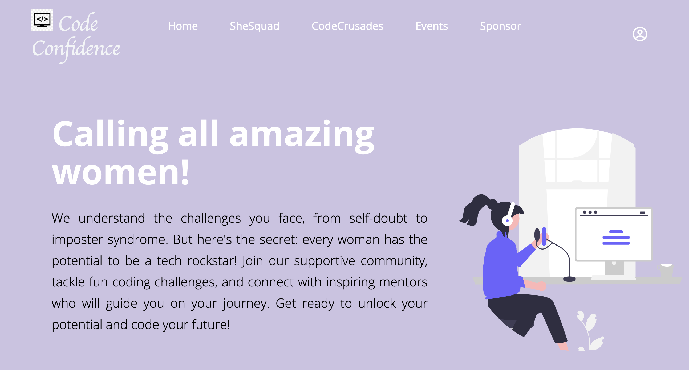
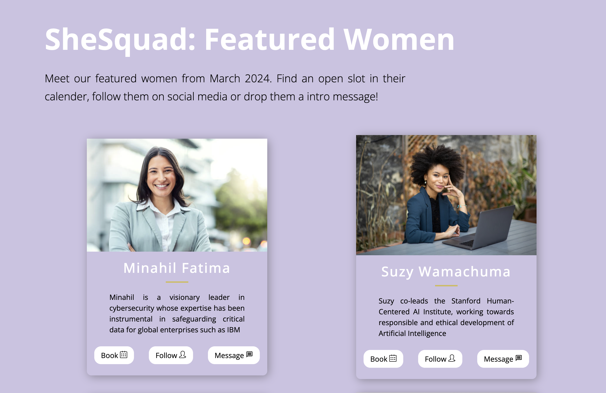
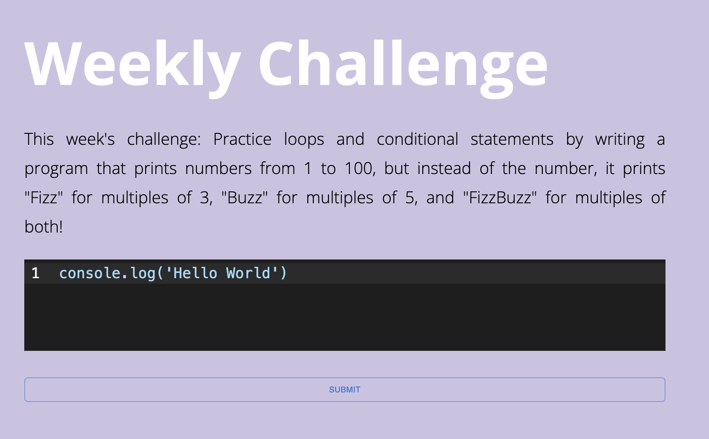
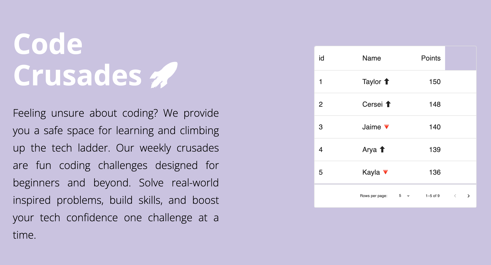
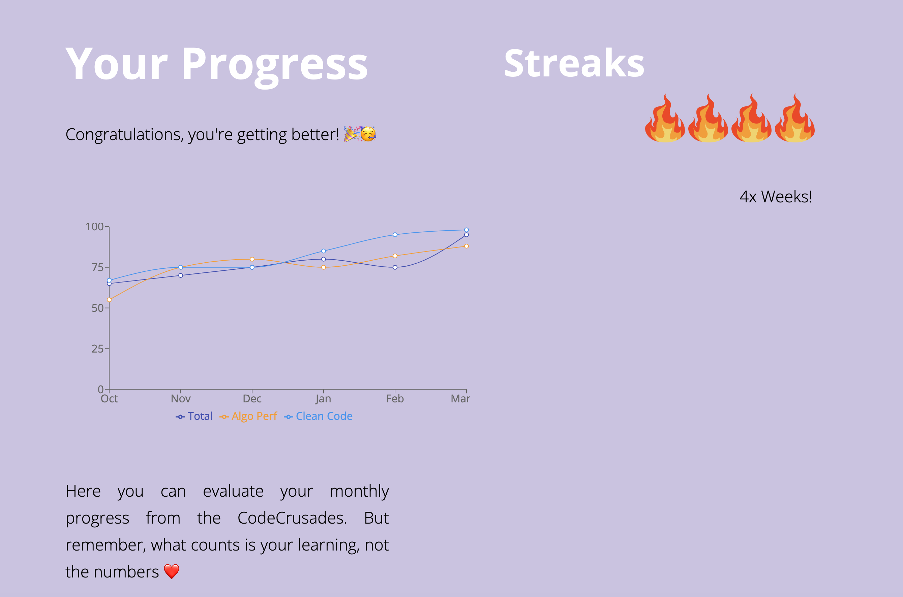
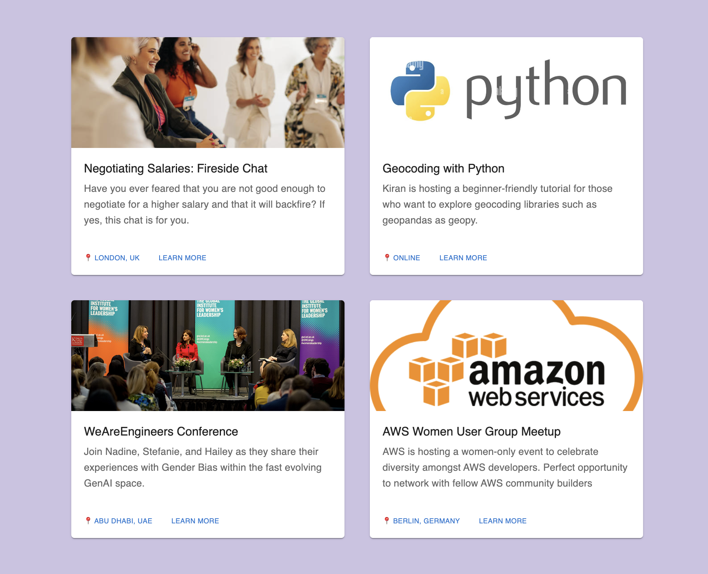

# CodeConfidence 
## Short Description

CodeConfidence tackles the confidence gap by showcasing inspiring women who are rocking the tech world. Through our SheSquad mentor match program, you can connect with amazing mentors who will guide you on your coding journey. Sharpen your skills and gain recognition with our fun, weekly CodingCrusades. Climb the leaderboard and see your progress alongside other women. You can also use our Event Directory to discover free women-oriented tech events and conferences. Join a supportive community of women who are changing the face of tech, one line of code at a time.



# The Problem

According to a research, nearly 100% of women cite confidence as the biggest barrier to enter tech. Women often struggle to see themselves in tech careers because they haven't seen many successful women in the field and so they lack the confidence to get started. Imposter syndrome is a big, big issue!

# Feature: SheSquad

This is a mentor matching program where women can apply and get matched to an industry expert or even a fellow-learner with the same goals. Through industry experts, they can learn more about inspiring stories and career paths. On the other hand, they can also pair with people from similar backgrounds so that they can learn from each other, discuss their challenges, and grow together.



# Feature: Code Crusades

CodeCrusades are fun coding challenges that can help women gain confidence over time. Top performing members can also get a chance to be featured on the Leaderboard so this adds to the motivation to participate. Users can also track their monthly progress across different criteria for example clean code and algorithmic understanding. 

Most importantly, our CodeCrusades can foster a healthy competition within women. A lot of times women see only men winning tech competitions so they are too afraid to even participate. Hence, our platform will be a breath of fresh air for them. 







# Feature: Event Directory

These days, we see many smaller communities or organisations working towards empowering women in tech, but it gets so hard to learn about all these opportunities. Hence, we can create a global event directory where users can find all sorts of online and offline events. This could include technical workshops, conferences, hackathons, scholarship opportunities etc.



## Technologies 

* React js
* Next js
* HTML/CSS

React libraries such as:

* recharts
* Material UI
* react-icons

## NPM Installation

https://radixweb.com/blog/installing-npm-and-nodejs-on-windows-and-mac
```
npm install next@latest react@latest react-dom@latest
```
## Run the project

Run:
```
npm run dev
```

Open ```http://localhost:3000/``` in your browser.